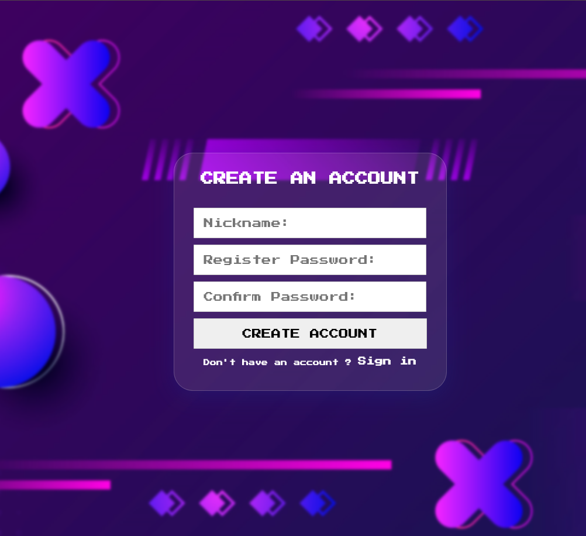
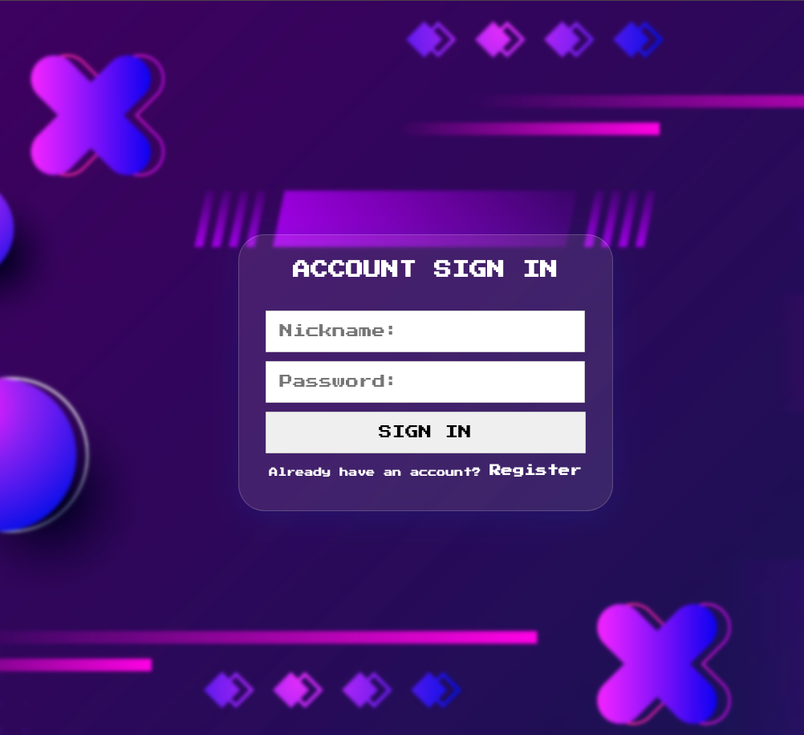
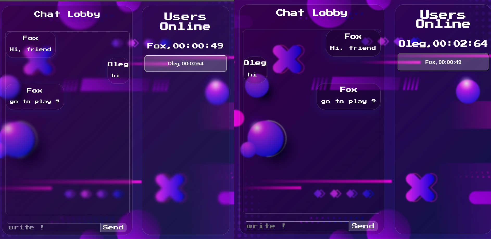
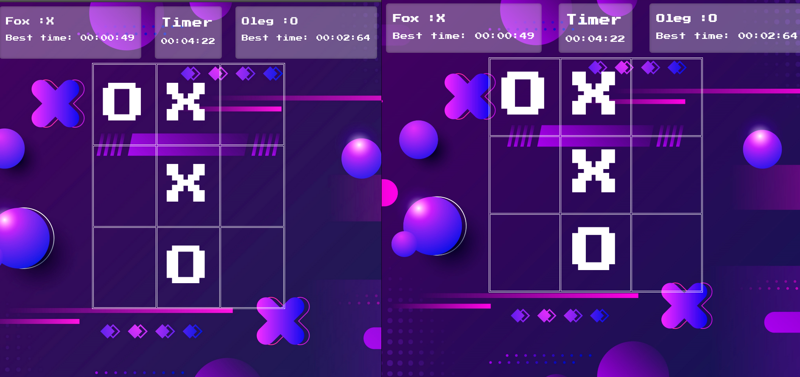

## authorization



## sing in 



## lobby 



## game 




## Installation go (./Tic-Tac-To-with-React-Express-Socket.IO/server-ts) 

```bash (./server-ts) 
$ npm install
```

##  Running the app (./server-ts) 

```bash (./server-ts) 
$ npm run start 

```

##  development mode (Server) (./server-ts)

```bash (./server-ts)
$ tsc watch

$ npm run bev

```
##  development mode (Client) (./client)

```bash (./client) 
$ npm run dev 

```

##  building the project (Client) (./client)

```bash (./client) 
$ npm run build

```

## Stay in touch

- Author - [Oleg TUBE-GULL](https://github.com/TUBE-GULL)
